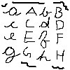
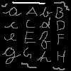
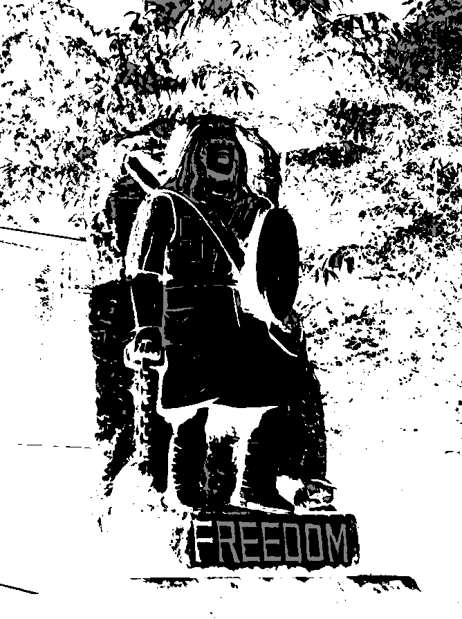
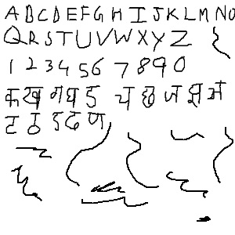
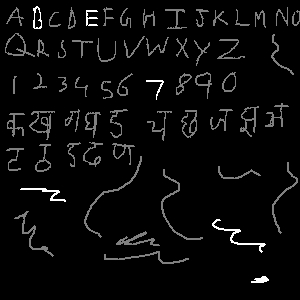

# Stroke Width Transform

Zero-dependency, public domain header-only library that implements [Stroke Width Transform](https://www.microsoft.com/en-us/research/wp-content/uploads/2016/02/1509.pdf)

See:

- [Quickstart](#quickstart)
- [Examples](#examples)
- [Gallery](#gallery)
- [Tests](#tests)

## Quickstart

Grab a copy of [swt.h](./swt.h) and load it in your project as a stb-style lib

The documentation for functions is also contained within the header file

```c
#define SWT_IMPLEMENTATION
#include "swt.h"
```

## Examples

Here is how you would use this with stb

```C
  /* ... */

    SWTImage image = { image_data, width, height, channels };
    SWTData *data = swt_allocate(width * height);

    swt_apply_stroke_width_transform(&image, data->components, data->results);
    
    // optionally visualize the points on the image
    swt_visualize_text_on_image(&image, data->results, 4);

    swt_free(data);

  /* ... */
```

this will produce the following output

## Gallery

| Original image                                                          | Detected text (Highlighted in Gray)                                                    |
|-------------------------------------------------------------------------|----------------------------------------------------------------------------------------|
|    |    |
|  |  |
|  |  |


## Tests

The tests are written using [µnit](https://nemequ.github.io/munit/) find them at [`tests/`](./tests)

```
.\build.bat TEST
.\swt_test.exe
```

